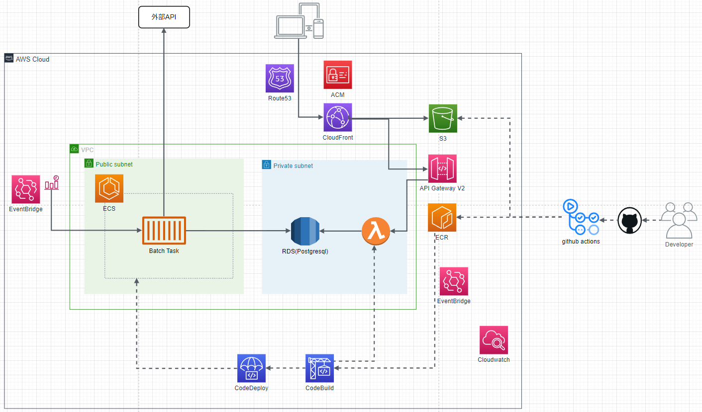

# ITrender アプリ

## 概要

Youtube,Qiita,Zenn,TechPlus,ThinkIT から毎日ランキングを取得し、お好みのワードで検索可能。

https://itrender.net/

## アプリへのこだわり

lambda で動かすため軽量性を重視し、初めて fastapi を使用。

必要最低限の機能しか提供されていないため好きなモジュールでカスタマイズ可能。

フロントエンドは react を使用。

## インフラへのこだわり

### ランニングコスト

出来るだけランニングコストを省くためバックエンドを lambda で動かしている。

### 自動化

ECR へのイメージ push は github actions を使用し、デプロイには Code シリーズを使用。

### IaC

cloudformation の gitsync を使用し、gitOps を実現。

# 構成

# 今後

google auth を使用してログイン機能を追加しブックマーク機能の実装。
